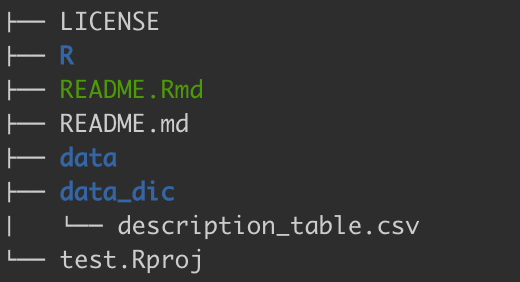

<!-- README.md is generated from README.Rmd. Please edit that file -->

```{r, include = FALSE}
knitr::opts_chunk$set(
  collapse = TRUE,
  comment = "#>",
  fig.path = "man/figures/README-",
  out.width = "100%"
)

library(tidyverse)
library(knitr)
library(dataDocumentation)
library(knitr)
```

# dataDocumentation


The goal of the **dataDocumentation** package is to make documenting your data easier in the Between the Fjords lab.
The goal is to make openly available for the members in the BTF lab and also beyond.
For this, we use reproducible and transparent workflows and properly document each step and object.

Each dataset should be properly documented with a **data dictionary**.
A data dictionary is a document that describes each variable of a dataset.
This package helps you to create a data dictionary for all your datasets.

Another aspect of our workflow is to make different datasets talk to each other.
For this, we need a pre-defined **naming convention**.
Therefore, this package contains functions to create the **meta data** for the Funder and ThreeD project.
The meta data contains a complete file with the experimental strucutre including site, block, plot, treatment names.


## Installation

You can install `dataDocumentation` from  [GitHub](https://github.com/) with:

``` {r install, eval=FALSE, echo=TRUE}
# if needed install the remotes package
install.packages("remotes")

# then install the dataDocumentation package
remotes::install_github("audhalbritter/dataDocumentation")

# and load it
library(dataDocumentation)

```

## Functions

### get started

The first time you use the package in a project run the `get_started()` function.
This function will help you to set up a new directory for creating the data dictionary.
In addition, it will create a template file for the description table.

The function has one argument `path`, where you can choose the location for the new directory.
The default is "data_dic".

``` {r get-started, eval=FALSE, echo=TRUE}

get_started(path = "data_dic")

```

There is now a new folder called **data_dic** in the folder structure and it contains a file called **description_table.csv**.

``` {r dir-tree, echo=FALSE, out.width = '40%'}



```


### description table

The description table is an empty file with four columns:

``` {r description-table, eval=TRUE, echo=FALSE}

tibble(TableID = character(),
           Variable_name = character(),
           Description = character(),
           Units = character(),
           "How measured" = character()) |> 
  knitr::kable()

```

This table has to be populated with information.

The **TableID** is optional and is a unique identifier for each dataset.
The variable is useful when you have the same variable name in different datasets with different meanings.
Then this variable defines which dataset a variable description belongs to.
For example if you have use value it can be the value for biomass or decomposition and belonging to different datasets.
You can use the different definitions for each dataset and distinguish them using TableID.

**Variable name** is the name of the variable in a dataset.
It should be spelled exactly the same as in the dataset.

**Description** is the description of the variable.
It should be concise but detailed enough to understand the variable.
For example: 

- Year of sampling
- Unique plot ID is a combination of site, block and treatment
- Removed functional group, including forbs, bryophytes, graminoids. For extra controls also litter, pteridophytes, lichens, and cryptograms

**Units** defines the unit of a variable.
For example g, cm^3^

**How measured** describes how the variable was obtained.
For example measured, recorded or defined.

Fill in all the information for each variable in your dataset(s).
If you have multiple datasets, all variables can be entered in the same document.
Use **TableID** to identify the dataset.


### make data dictionary

The next step is to make the data dictionary.
For this you can use the `make_data_dic()` function.


``` {r data-dic, eval=TRUE, echo=TRUE}

# load dataset and description table
data(description_table)
data(biomass)
data_dic <- make_data_dictionary(data = biomass,
                                 description_table = description_table,
                                 table_ID = "biomass",
                                 keep_table_ID = FALSE)

```

This function gets the **range**, and **class** for each variable in your dataset and combines this information with the **description table**.
The output looks like this:


``` {r data-dic-output, eval=TRUE, echo=FALSE}

data_dic |> 
  kable()

```


### meta data

The dataDocumentation also provides functions to create metadata for FUNDER, Durin and ThreeD.
The functions are called `create_funder_meta_data()`, `create_durin_meta_data()` and `create_threed_meta_data()`.
These functions creates a tibble with the complete meta data including siteID, blockID, treatment and plotID for FUNDER.
For Durin there it can create 3 different meta data tables (see below).
Origin and destination siteID, blockID and plotID, turfID, warming, grazing and Nlevel for ThreeD.

Just run the code like this:

``` {r meta-data, eval=TRUE, echo=TRUE}

meta_data <- create_funder_meta_data()

meta_data

```

If you want to save the metadata as a csv file, set `csv_output = TRUE` and choose a file name `filename`.
The data will be stored in the project  directory.
The file name always contains the project name (FUNDEr, Durin or ThreeD).

``` {r meta-data-output, eval=FALSE, echo=TRUE}

meta_data <- create_funder_meta_data(csv_output = TRUE, filename = "biomass")

```

#### Durin meta data

For the Durin project, the meta data can be made for the 4Corners, DroughtNet or Nutrient study.
The `create_durin_meta_data()` function has the argument `study`, which has to be defined. *4Corners*: study on the 4 main Durin sites; *DroughtNet*: droughtNet experiment at Lygra and Tjotta; *Nutrient*: nutrient experiment at Lygra


### funcabization

At some sites, FunCaB and FUNDER datasets have different blockID's.
This is problematic, when merging datasets from the different project.
`funcabization()` is a function to solve this problem.
This function can convert FUNDER terminology to FunCaB terminology and vice versa.
Note that data on OSF should be on FunCaB nomencaltur.

`funcabization()` has two arguments.
The first one is `dat` and takes the data for input.
The second argument is `covnert_to` and here you define if you want to convert a dataset to *FunCaB* or *Funder* nomenclature.

``` {r funcabization, eval=FALSE, echo=TRUE}

data(funder)
funcabization(dat = funder, convert_to = "FunCaB")

data(funcab)
funcabization(dat = funcab, convert_to = "Funder")

```
