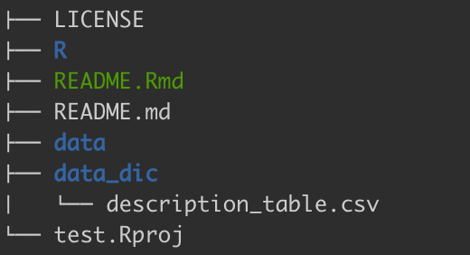

<!-- README.md is generated from README.Rmd. Please edit that file -->

# dataDocumentation

The goal of the **dataDocumentation** package is to make documenting
your data easier in the Between the Fjords lab. The goal is to make
openly available for the members in the BTF lab and also beyond. For
this, we use reproducible and transparent workflows and properly
document each step and object.

Each dataset should be properly documented with a **data dictionary**. A
data dictionary is a document that describes each variable of a dataset.
This package helps you to create a data dictionary for all your
datasets.

Another aspect of our workflow is to make different datasets talk to
each other. For this, we need a pre-defined **naming convention**.
Therefore, this package contains functions to create the **meta data**
for the Funder and ThreeD project. The meta data contains a complete
file with the experimental strucutre including site, block, plot,
treatment names.

## Installation

You can install `dataDocumentation` from [GitHub](https://github.com/)
with:

``` r
# if needed install the remotes package
install.packages("remotes")

# then install the dataDocumentation package
remotes::install_github("audhalbritter/dataDocumentation")

# and load it
library(dataDocumentation)
```

## Functions

### get started

The first time you use the package in a project run the `get_started()`
function. This function will help you to set up a new directory for
creating the data dictionary. In addition, it will create a template
file for the description table.

The function has one argument `path`, where you can choose the location
for the new directory. The default is “data_dic”.

``` r
get_started(path = "data_dic")
```

There is now a new folder called **data_dic** in the folder structure
and it contains a file called **description_table.csv**.



### description table

The description table is an empty file with four columns:

| TableID | Variable_name | Description | Units | How measured |
|:--------|:--------------|:------------|:------|:-------------|

This table has to be populated with information.

The **TableID** is optional and is a unique identifier for each dataset.
The variable is useful when you have the same variable name in different
datasets with different meanings. Then this variable defines which
dataset a variable description belongs to. For example if you have use
value it can be the value for biomass or decomposition and belonging to
different datasets. You can use the different definitions for each
dataset and distinguish them using TableID.

**Variable name** is the name of the variable in a dataset. It should be
spelled exactly the same as in the dataset.

**Description** is the description of the variable. It should be concise
but detailed enough to understand the variable. For example:

-   Year of sampling
-   Unique plot ID is a combination of site, block and treatment
-   Removed functional group, including forbs, bryophytes, graminoids.
    For extra controls also litter, pteridophytes, lichens, and
    cryptograms

**Units** defines the unit of a variable. For example g, cm<sup>3</sup>

**How measured** describes how the variable was obtained. For example
measured, recorded or defined.

Fill in all the information for each variable in your dataset(s). If you
have multiple datasets, all variables can be entered in the same
document. Use **TableID** to identify the dataset.

### make data dictionary

The next step is to make the data dictionary. For this you can use the
`make_data_dic()` function.

``` r
# load dataset and description table
data(description_table)
data(biomass)
data_dic <- make_data_dictionary(data = biomass,
                                 description_table = description_table,
                                 table_ID = "biomass",
                                 keep_table_ID = FALSE)
```

This function gets the **range**, and **class** for each variable in
your dataset and combines this information with the **description
table**. The output looks like this:

| Variable name | Description                                                                                                                                                          | Variable type | Variable range or levels | Units | How measured |
|:--------------|:---------------------------------------------------------------------------------------------------------------------------------------------------------------------|:--------------|:-------------------------|:------|:-------------|
| year          | Year of sampling                                                                                                                                                     | numeric       | 2015 - 2015              | yyyy  | defined      |
| siteID        | Unique site ID                                                                                                                                                       | categorical   | Gudmedalen - Ulvehaugen  | NA    | defined      |
| blockID       | Unique block ID a combination of site and block                                                                                                                      | categorical   | Gud12 - Ulv4             | NA    | defined      |
| plotID        | Unique plot ID is a combination of site, block and treatment                                                                                                         | categorical   | Gud12B - Ulv4GB          | NA    | defined      |
| treatment     | Plant functional groups removed, where F = forbs, G = graminoids, B = bryophytes and C = control, and XC = extra control                                             | categorical   | B - GF                   | NA    | defined      |
| removed_fg    | Removed functional group, where F = forbs, B = bryophytes, G = graminoids. For extra  controls also L = litter, P = pteridophytes, LI = lichens, and C = cryptograms | categorical   | B - G                    | NA    | defined      |
| biomass       | Dry weight of removed functional_group                                                                                                                               | numeric       | 0.01 - 32.5              | g     | measured     |
